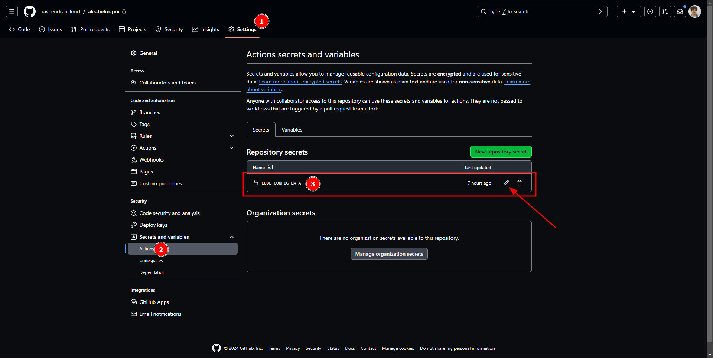

test

# Sources

- Kubernetes webapp source: https://github.com/devteds/demo-apps-on-k8s
- How to transform a deployment in a helm chart: https://blog.searce.com/transform-kubernetes-manifests-into-helm-chart-f3d100688423
- Adminer: https://www.adminer.org/

### Notes:
This gig was inspired in the previously mentioned webapp, but helm charts were created from the repo manifests.

<br/>

# Steps to get AKS running & webapp deployed:

## Creating the AKS cluster and getting the login credentials in a .kube file

```
az login --tenant ae19e230-0338-479b-af50-46ea9e741866
az account set --subscription 701d7577-5f8f-4a06-a53e-66677f5028c2

cd ./terraform
terraform init
terraform plan
terraform apply --auto-approve

az aks get-credentials --resource-group aks-helm-poc --name aks --overwrite-existing --admin

```

## Putting the aks login credentials in the correct github secret

Locally run: 
```
cat ~/.kube/config | base64
```

copy the output and place it inside the secret:




## Creating the MySQL and Ingress Controller in the AKS.

Go to github workflows and run the workflow named **Apply MySQL and Ingress Controller Helm Charts** (mysql-ingress-charts.yaml)

## Deploying the website

Run the workflow: