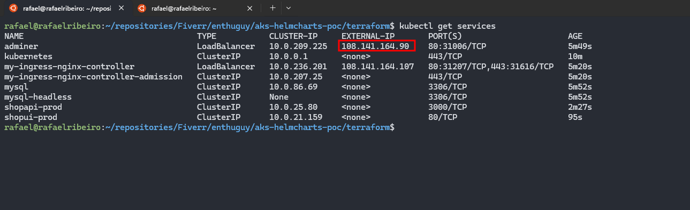
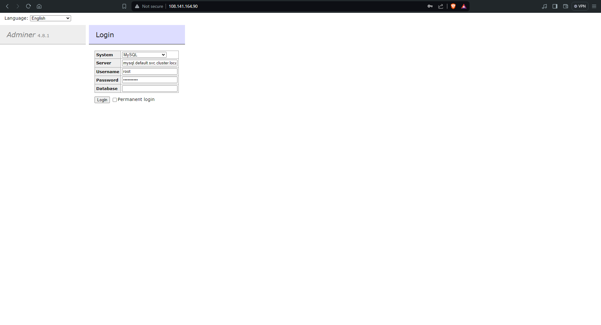
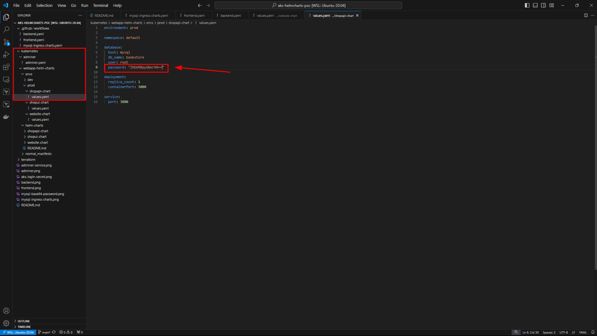
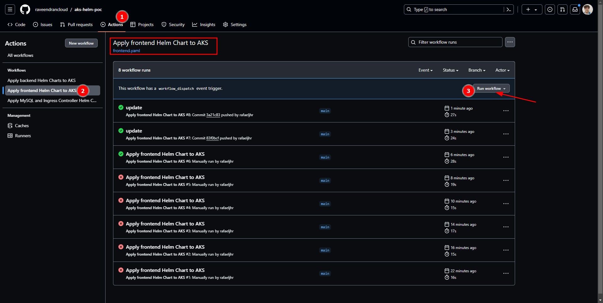
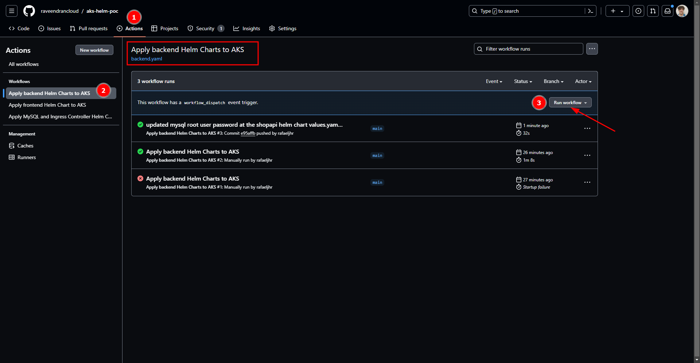
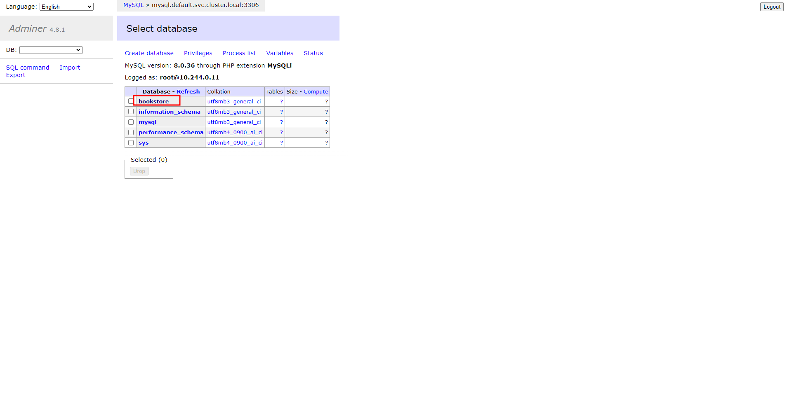
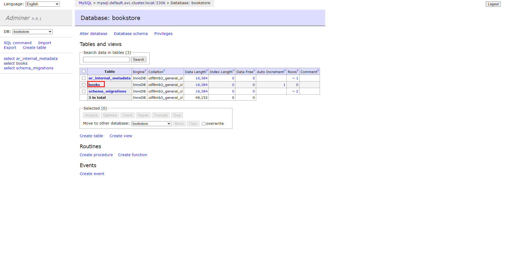
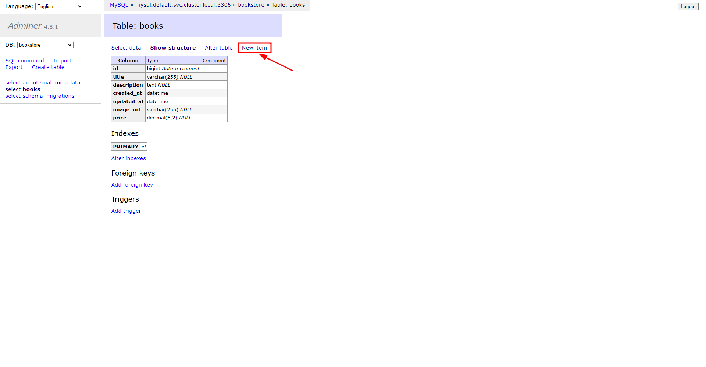
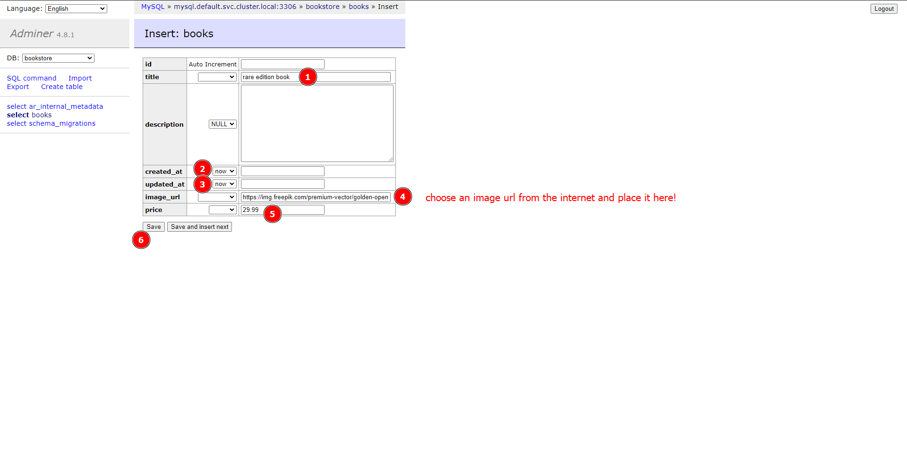
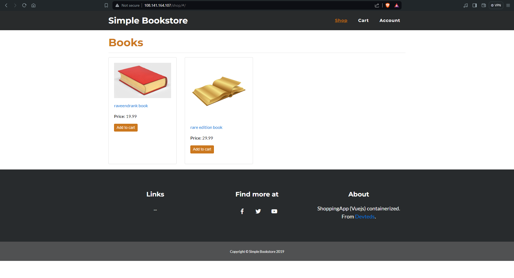

# Sources

- Kubernetes webapp source: https://github.com/devteds/demo-apps-on-k8s
- How to transform a deployment in a helm chart: https://blog.searce.com/transform-kubernetes-manifests-into-helm-chart-f3d100688423
- Adminer: https://www.adminer.org/

### Notes:
This gig was inspired in the previously mentioned webapp, but helm charts were created from the repo manifests.

<br/>

# Steps to get AKS running & webapp deployed with the helm charts:


## Creating the AKS cluster and getting the login credentials in a .kube file

```
az login --tenant ae19e230-0338-479b-af50-46ea9e741866
az account set --subscription 701d7577-5f8f-4a06-a53e-66677f5028c2

cd ./terraform
terraform init
terraform plan
terraform apply --auto-approve

az aks get-credentials --resource-group aks-helm-poc --name aks --overwrite-existing --admin

```


## Putting the AKS cluster login credentials in the correct github secret

Locally run: 
```
cat ~/.kube/config
```

copy the output and place it inside the secret:


## Applying MySQL and Nginx Ingress Controller Helm Charts to the AKS cluster

Go to github workflows and run the workflow named **Apply MySQL and Ingress Controller Helm Charts** (mysql-ingress-charts.yaml)


### Note:

Adminer is installed alongside the charts. adminer is a tool to administer databases, like mysql, via web interface.

You can get the adminer public ip by locally executing (remember to be logged in to your aks cluster!):
```
kubectl get services
```





You can get the root user password by running:
```
kubectl get secret --namespace default mysql -o jsonpath="{.data.mysql-root-password}" | base64 -d
```


## Get the mySQL database root password and place it in the correct backend helm chart value

Locally execute (remember to be logged in to your aks cluster!):
```
kubectl get secret --namespace default mysql -o jsonpath="{.data.mysql-root-password}"
```


**copy the value** and place it on kubernetes/webapp-helm-charts/envs/<choose-env>/shopapi-chart/values.yaml :



Push the change to github:
```
git add -A
git commit -m 'updated mysql root user password at the shopapi helm chart values.yaml file'
git push
```


## Deploying the frontend helm chart

Run the workflow **Apply frontend Helm Chart to AKS** (frontend.yaml)



### Note: You can also update the files value.yaml and submit the changes to github. This will trigger a workflow that will apply/upgrade the helm chart.


## Deploying the backend helm charts

Run the workflow **Apply backend Helm Charts to AKS** (backend.yaml)



### Note: You can also update the files value.yaml and submit the changes to github. This will trigger a workflow that will apply/upgrade the helm charts.


## Using the website

Add a book to the database!

1. Login in adminer 


2. Select the bookstore database and then the books table



3. Add a book



3. Check the book for sale in the store!
